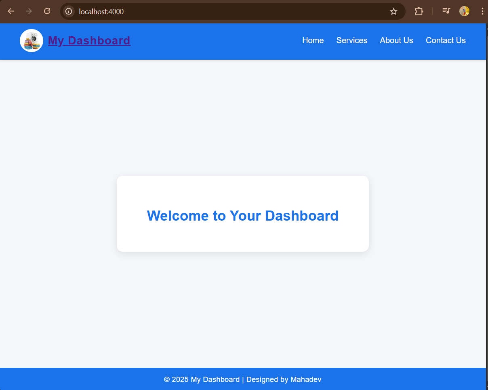
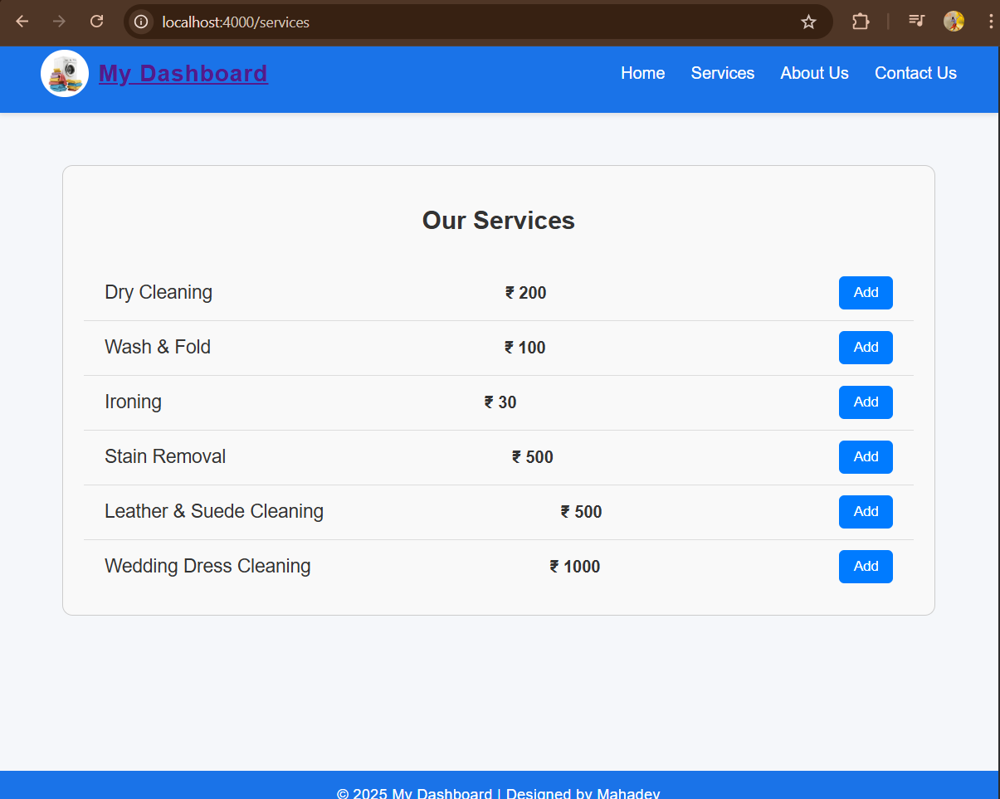
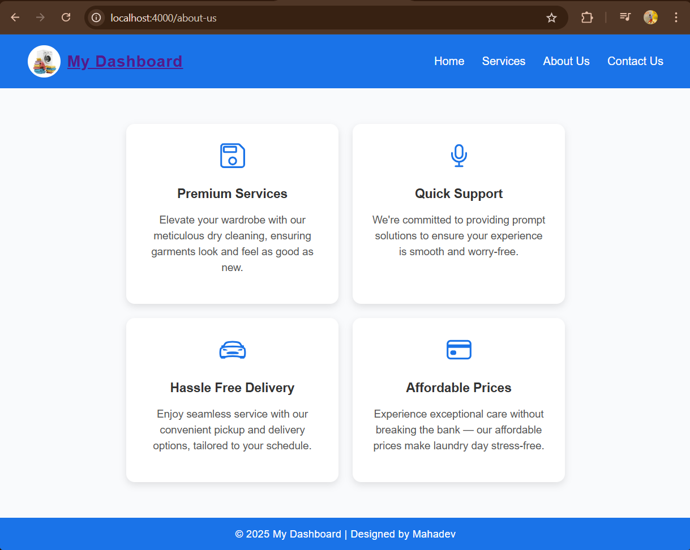
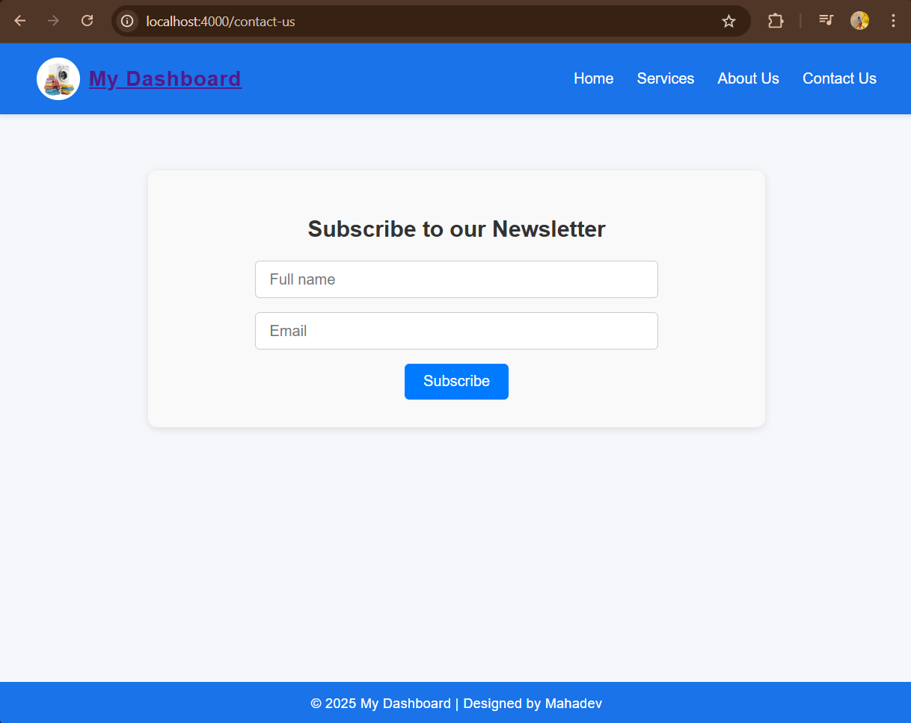

# Creating a Simple Web Server with ``Node.js``

## Use the `http` module to create a server.
 ```
 const http = require('http');
 const PORT = 4000;
 ```
## How to run
```
 npm i nodemon
 npm run dev
 ```
 - Use nodemon for refresh problem.

## Structure
  - header
  - routes
  - footer

## routes
 - **All are get mehtod**
 - `'/'` for dashboard.
  
 - `'/home'` for home
 
 - `'/services'` for Services
 
 - `'/about-us'` for About us
 
 - `'/contact-us'` for Contact us
 

